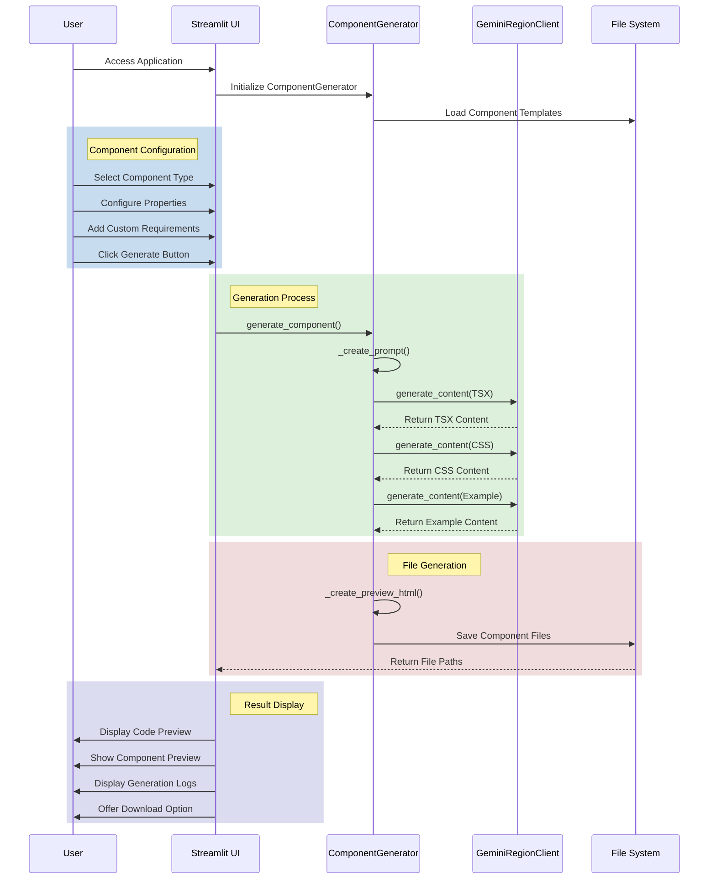
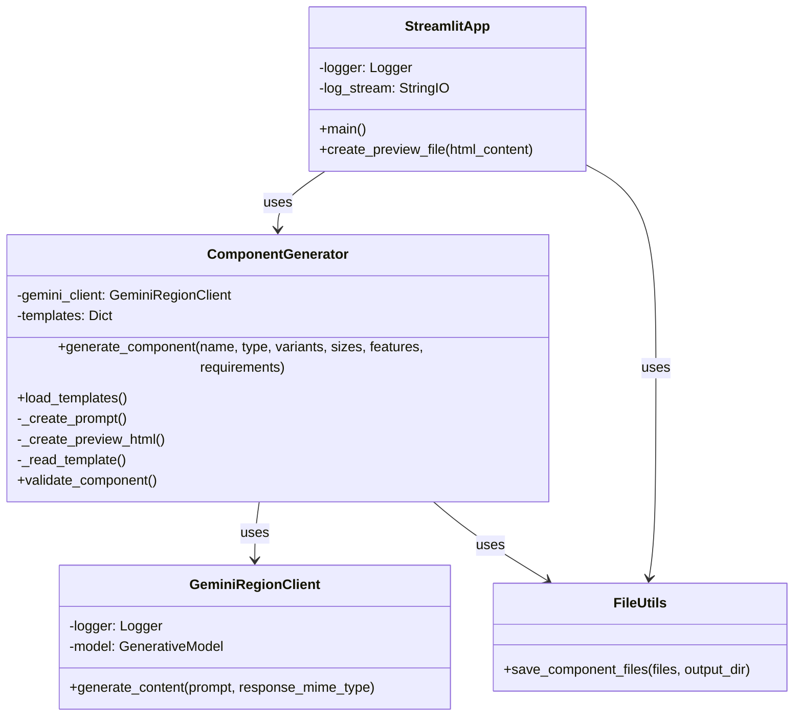

```mermaid
sequenceDiagram
    participant User
    participant Streamlit as Streamlit UI
    participant CompGen as ComponentGenerator
    participant Gemini as GeminiRegionClient
    participant FileSystem as File System

    User->>Streamlit: Access Application
    Streamlit->>CompGen: Initialize ComponentGenerator
    CompGen->>FileSystem: Load Component Templates
    
    rect rgb(200, 220, 240)
        Note right of User: Component Configuration
        User->>Streamlit: Select Component Type
        User->>Streamlit: Configure Properties
        User->>Streamlit: Add Custom Requirements
        User->>Streamlit: Click Generate Button
    end

    rect rgb(220, 240, 220)
        Note right of Streamlit: Generation Process
        Streamlit->>CompGen: generate_component()
        CompGen->>CompGen: _create_prompt()
        CompGen->>Gemini: generate_content(TSX)
        Gemini-->>CompGen: Return TSX Content
        CompGen->>Gemini: generate_content(CSS)
        Gemini-->>CompGen: Return CSS Content
        CompGen->>Gemini: generate_content(Example)
        Gemini-->>CompGen: Return Example Content
    end

    rect rgb(240, 220, 220)
        Note right of CompGen: File Generation
        CompGen->>CompGen: _create_preview_html()
        CompGen->>FileSystem: Save Component Files
        FileSystem-->>Streamlit: Return File Paths
    end

    rect rgb(220, 220, 240)
        Note right of Streamlit: Result Display
        Streamlit->>User: Display Code Preview
        Streamlit->>User: Show Component Preview
        Streamlit->>User: Display Generation Logs
        Streamlit->>User: Offer Download Option
    end
```

## Class Diagram

```mermaid
classDiagram
    class StreamlitApp {
        -logger: Logger
        -log_stream: StringIO
        +main()
        +create_preview_file(html_content)
    }

    class ComponentGenerator {
        -gemini_client: GeminiRegionClient
        -templates: Dict
        +generate_component(name, type, variants, sizes, features, requirements)
        +load_templates()
        -_create_prompt()
        -_create_preview_html()
        -_read_template()
        +validate_component()
    }

    class GeminiRegionClient {
        -logger: Logger
        -model: GenerativeModel
        +generate_content(prompt, response_mime_type)
    }

    class FileUtils {
        +save_component_files(files, output_dir)
    }

    StreamlitApp --> ComponentGenerator : uses
    ComponentGenerator --> GeminiRegionClient : uses
    StreamlitApp --> FileUtils : uses
    ComponentGenerator --> FileUtils : uses
```